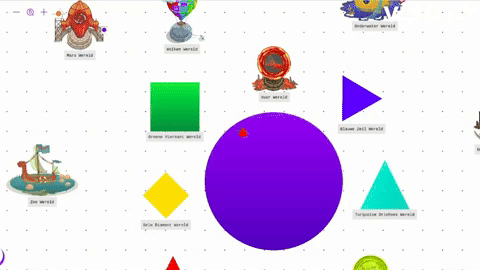
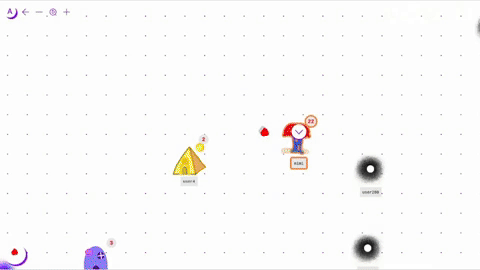
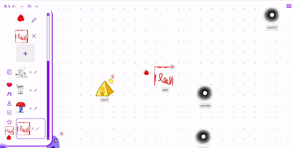
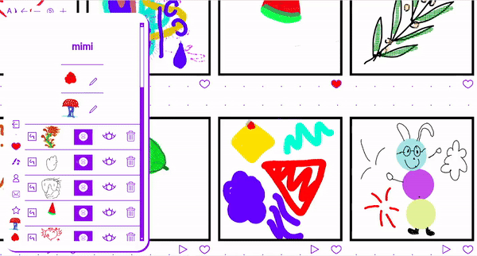

This is the repo for ARTWORLD, a game for kids to make and exhibit art in. 
ARTWORLD is a multi user game, so players see and can interact with each other.

ARTWORLD want to support many art forms: drawing, stop motion animation, music, dance and poetry.
ARTWORLD is also designed to work on any device: phone, tablet, computer. Also slower or older devices.

ARTWORLD is build on [PHASER game engine](https://phaser.io/) and the [NAKAMA game server](https://heroiclabs.com/nakama/), both excellent open source projects.

ARTWORLD is made in JavaScript, NODEJS and SVELTE. As a file storage backend we use AWS.

ARTWORLD is conceived and financed by [De Vrolijkheid](https://vrolijkheid.nl/projecten/artworld)

ARTWORLD is designed, programmed and project managed by [Maarten van der Glas](https://github.com/mrmaarten) @ [Studio Play](https://studioplay.nl).

Server development 1.0 - 1.5 and SVELTE programming by 1.0 - 1.4 by [Lindsey Schaap](https://github.com/linjoe2).

SVELTE 1.4 - 1.5 overall, code refactoring and improvement and UI improvements by [Eelke Feenstra](https://github.com/eelke).

UI concepts and icons by design studio [Harris Blondman](https://www.harrisblondman.nl/)

Ingame graphics are made by Max Holicki, and are not open source.

[Documentation](https://studioplaynl.github.io/ARTWORLD_client/)

The game is only playable with an account. But here is a [project page about it](https://vrolijkheid.nl/projecten/artworld/)